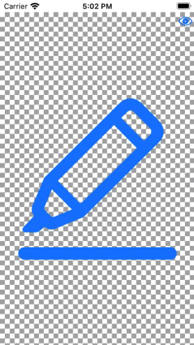

# QCAlphaBackgroundView

A subclass of UIView that acts as an Alpha channel. Best used to show transparent images.

## Usage
```

// just add QCAlphaBackgroundView as subclass in storyboard or in code create its instance.
let alphaBGView = QCAlphaBackgroundView()

// and you change the appearrance like this
switch alphaBGView.backgroundTheme {
    case .light:
        self.alphaBGView.backgroundTheme = .dark
    case .dark:
        self.alphaBGView.backgroundTheme = .custom(firstColor: .red.withAlphaComponent(0.5), secondColor: .orange.withAlphaComponent(0.5))
    case .custom(firstColor: _, secondColor: _):
        self.alphaBGView.backgroundTheme = .light
}

```


